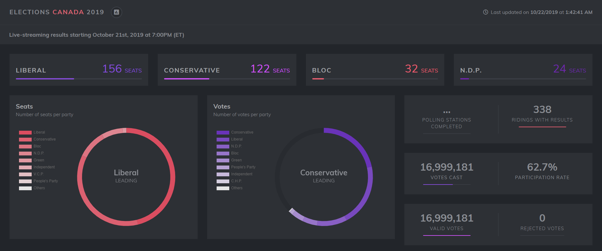

# Canada's 2019 General Election
> Dashboard for Canada's 2019 electoral results

## Live Dashboard

Live dashboard: [https://philsawicki.github.io/election-canada-2019](https://philsawicki.github.io/election-canada-2019)

## Installation

Prerequisite: [NodeJS](https://nodejs.org) (>= 12.0.0)

Installation steps:
 1. Run `npm install`
 2. Run `npm run build` (or `npm run build:watch` during development)
 3. Run `npm run serve`
 4. Navigate to [http://localhost:3003](http://localhost:3003)
